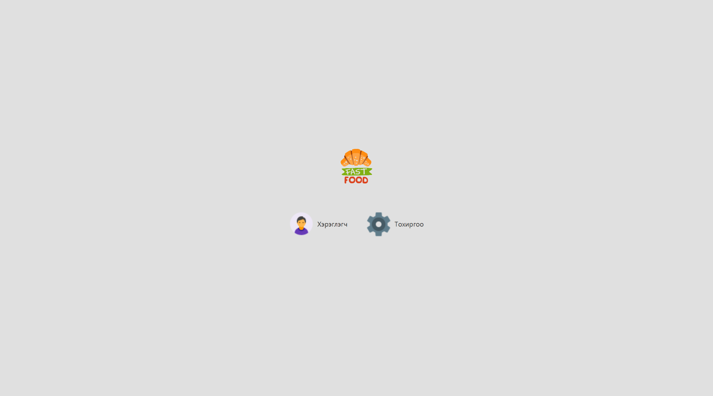
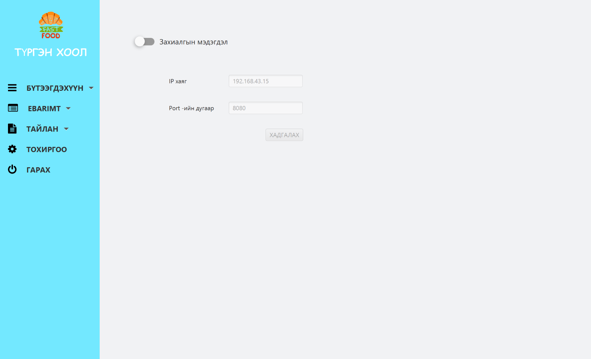
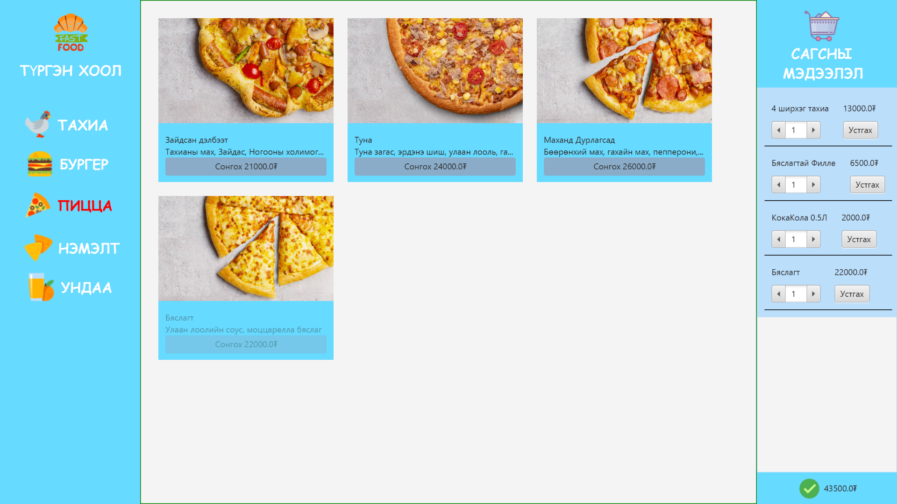
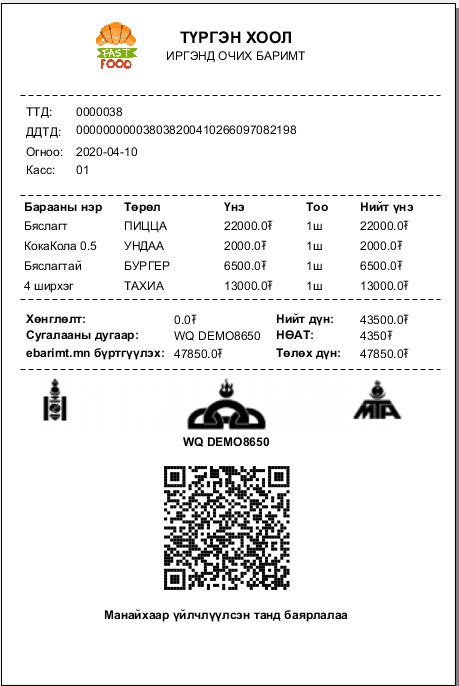

# javafx-fast-food

Хөгжүүлэлтийн технологи
1.  JavaFX 
JavaFX нь Java хөгжүүлэгчдэд шинэ хөнгөн, өндөр гүйцэтгэлтэй график платформоор хангахад зориулагдсан. Зорилго нь програмын график интерфэйсийн (GUI) бүтээх Swing-г ашиглахын оронд JavaFX-г ашиглах шинэ програмуудад зориулагдсан юм. Энэ нь Swing хуучирсан гэсэн үг биш юм. Swing ашиглан баригдсан асар олон тооны аппликейшн нь Java API-ийн нэг хэсэг байх болно гэсэн үг юм. Ялангуяа JavaFX функцийг эдгээр програмууд нэгтгэж болох тул хоёр график API нь урд талд нь урагшилдаг. JavaFX нь ямар ч платформд зориулж график хэрэглэгчийн интерфэйсийг үүсгэхэд ашиглаж болно (жишээ нь, ширээний, вэб, хөдөлгөөнт гэх мэт). 

2.  PosAPI
PosAPI 2.1 сан нь C++ хэл дээр бичигдсэн бөгөөд хэрэглэгчийн систем нь уг сантай холбогдоход PosAPI.hболон ExportLib.hheader файлуудын тусламжтайгаар холбогдоно. C++ хэл нь бусад програмчлалын хэлтэй шууд холбогдох бүрэн боломжтой байдаг бөгөөд холбох үедээ дундын bridge library /зураг 6/ үүсгэхшаардлага тулгардаг.

3. JSON
XML-той харьцуулахад түүний товчлолоос хамаарч JSON формат нь цогц бүтэцтэй цуваачлахад илүү тохиромжтой байж болох юм. Хэрэв бид вэб програмын талаар ярих юм бол энэ аргаар хөтөч болон сервер (AJAX) хоёрын хооронд өгөгдөл солилцох даалгавар, мөн серверүүдийн хооронд (HTTP програмын интерфэйсүүд) хамааралтай байдаг. JSON формат нь JavaScript синтаксын нэг хэсэг бөгөөд үүгээрээ built in eval () функцоор хурдан задардаг. Үүнээс гадна бүрэн ажиллагаатай JavaScript-функцуудыг оруулах боломжтой. PHP хувилбарт 5.2.0 хувилбараас эхлэн JSON дэмжлэг нь цөмд json_decode () болон json_encode () функцүүдээр орсон бөгөөд тэдгээр нь JSON-ийн өгөгдлийн төрлийг харгалзах PHP төрлүүд уруу хөрвүүлдэг.

4. JASPERSOFT
Өөрийн Java project-доо Jasperreports оруулж түүнийгээ Gradle task болгон compile хийх боломжтой болж байгаа юм.

Хэрхэн ашиглах вэ?

Хэрэглэгч гэх сонголтоор нэвтэрч орсноор та системийг ашиглах боломжтой

Тохиргоо хэсгээр нэвтэрч орсноор бараа 
  -бүтээгдэхүүн нэмэх, хасах, засах
  -ebarimt бүртгэгдсэн бараа буцаах болон борлуулалтын мэдээлэл илгээх
  -Бүх төрслийн тайлан оноосон хугацааны завсарт гаргаж авах
  -Програм тохируулах зэрэг үйлдлүүдийг хийх боломжтой.

Манай системийн хамгийн гол давуу тал бол TOUCH-тай дэлгэцэнд ажиллахаар зориулж хийгдсэн бөгөөд та хэний ч тусламжгүйгээр өөрийн гараар яг л ухаалаг утсаа удирдаж буй мэт захиалах багцаа идэвхжүүлэн хамгийн баруун зах руу зөөх шаарлагатай. Ингэж зөөсний дараа таны сонгосон багын үнийн мэдээлэл харагдах болно. Дээр нь нэмж хэдэн ч багц захиалж болох бөгөөд дэлгэцийн баруун доод буланд үнийн дүнгийн нэгдсэн мэдээлэл танд харагдах болно. Үнийн дүнгийн мэдээллийг та хүлээн зөвшөөр буй бол зөв тэмдэг дээр нэг товшино уу.

Төлбөр төлөх хэсгийг гүйцээсний дараа манай систем танд татварын е-баримтын мэдээллийг хэвлэж өгөх болно.   

Програм ажиллахад шаардагдах нэмэлт сан болон програмууд:
PosAPI Сангийн файлууд энэхүү төслийн /posApi хавтас дотор бүгд байгаа. Та энэхүү төсөл /project/ татаж авсны дараа /posApi файлын замыг System Variables path дотор зааж өгөх хэргтэй. Эсвэл working directory буюу програм эхэлж байгаа main.class, .jar, .exe файлын хажууд хуулж өгж мөн болно.  

Windows орчинд PosAPI 2.1 санг ажиллуулахдаа “Visual C++ Redistributable Package for Visual Studio 2013” програмыг заавал суулгасан байна. Учир нь PosAPI.dll болон ашиглагдаж буй нэмэлт сангууд нь Visual Studio 2013 C++ хэл ашиглан бичигдсэн байдаг тул заавал суусан байх ёстой.  
Татах холбоос: https://www.microsoft.com/en-us/download/details.aspx?id=40784

Мөн OpenSSL v1.0.2d Light заавал суулгасан байна.  
Татах холбоос: https://slproweb.com/products/Win32OpenSSL.html

